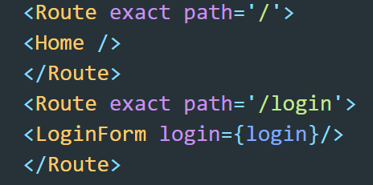
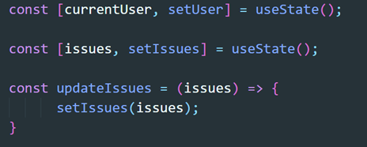

# ManageMyProperty
## Springboard-Section-50-Capstone-Project-2

### How do I get the app up and running?  
It's worth first reading the description of the app below, but as this is key information I've put it up front.

##### Getting the files
Create a folder on your own computer, ensuring it's not already a git repository.
There is a green button at the top right of this repository called 'Code' which you gives you the option to clone, download a zip file, or open with GitHub desktop. Choosing 'clone', fetches everything and puts it in your folder.  
If you want to clone, copy the link and then run this command: 'git clone https://github.com/johnhm22/Springboard-Section-50-Capstone-Project-2.git'    

##### Setting up the database
You'll need to install the database PostgreSQL and then set up the tables. There is a script included here called schema.sql. It creates the database called estate_management; first dropping it if it already exists, creating it from new and creating tables. In the console (I used Windows PowerShell), navigate to the same directory as the file schema.sql and then run the command: 'psql < schema.sql'.  

##### Installing dependencies
In the console, run 'npm init' in both of the folders frontend and backend.  

##### Running the backend
In the console, navigate to the directory called backend.  
Run the command 'node server.js'.  
(If you have nodemon installed you can run 'nodemon server.js).  
There are a number of console.log commands in the config.js file so on successful startup you will see in the console the following details:  
SECRET_KEY:  
PORT:  
BCRYPT_WORK_FACTOR:  
Database:  

For example:  

##### Frontend
In the console, navigate to the directory called frontend.  
Run the command 'npm start'. This will open a new browser window showing the landing page for the app.  
You can then start using the app by registering as a user.  
Currently, by default, all users are non-admin. Admin rights are assigned by changing the field directly in the database.
  

### Description
This app is desgined to both demonstrate technical skills and also provide something of use, which I hope may be used. 
Firstly, the motivation for the idea.  I own an apartment in a building which is managed by a managing agent. 
Naturally, problems crop up and they need to be sorted. Currently, other than email or a call, there is no way to report an issue
to the management. Even worse, there is no way to review the issues you have reported; look at the details, read the updates, check the progress.
For the managing agent, except for spreadsheets or a word document, there is no means to centrally hold all the issues and reviewing them in one place.  

Therefore, I thought I could answer this requirement and at the same time demonstrate some of the key coding skills and technologies I have picked up during the 
Springboard Software Engineering course.

#### What does the app do?
Let's look in more detail at the functionality of the app. from the perspective of the user.
If I am non-admin user, I have firstly to register before I can get access. This involves entering a series of details, such as username and password plus my property into a form.
On submission, I am in!  

Now I can create an issue, see my issues, update my issues, review updates made by admin users, and close my issues.
I can also view my profile details.  

As an admin user, the role of the managing agent who is responsible for resolving the problems, I can do all of the above, but, in addition, 
review issues created by other users, update any of them and close them.  

Yes, it's simple, but answers a genuine requirement and can be added to.

#### What technology was used in the coding?
The structure of the code is divided into front and backend.

###### Components
The core of React is components; in this case functional components.
We can consider them as reusable elements which can be customised by means of coding logic. Thus we can have a component to display a user's individual issues, but the code within the component ensures that only that user's issues are displayed and may even further tailor the display according to the type of user.
The return value of the component function is written in jsx code, which allows html to be written within javascript.  

At the top of each component, necessary libraries, hooks, and files are imported. At the bottom, the component is exported so it is available to the app.

###### Create React App
This uses Create React App which is a useful tool for building React components.  
As per convention, the top level component is App.js which renders all other components.
In addition, I have made use of React Router to allow for client-side routing. Whereas server-side routing requires an individual request to be made 
to the server for each new html page, with the client-side alternative, we still represent each page by a url address, all the rendering is done on the client side.  

To implement the routing functionality in React Router, the components, which are themselves wrapped in a <Route> tag, are all enclosed by <BrowserRouter>. 
This enables the routing.  

Going back to the <Router> tag, it has a couple of props. There is the component itself, but also the url.  
  Here is an example, if we go to the patch '/' the component Home is rendered. If we go to the path '/login', the component LoginForm is rendered. Route has been referred to as a translation service between the routes and the components.

You may also notice the LoginForm component contains a prop shown as login = {login}. This is a function called login that is passed to the LoginForm where it will be called, but executed on the App.js component where is it defined. In this particular case, the function will validate the login details of the user and allow access to the app. This practice has been widely used throughout the app.
  
  
One of the key features of React is hooks. In particular useState and useEffect have been used in various places. These allow great flexibility. React allows variable values to be passed down from component to component using props. The drawback is that the value of the prop cannot change. So, if you want to display something dynamic, such as the number of open issues, this is difficult. State in React allows us to set the value of state and, using a function, update it.  
  
Below is an example of how useState is deployed. It can used to keep track of the logged in user. Upon login, the verified user details are used to update currentUser using the setUser function. This is then passed to each component and used as a verification check before rendering data in the browser.  
  useState is also used to hold the latest version of the issues and a function, updateIssues, is defined and passed to components to be executed when the issues need updating.
  
  
  

Another hook, useParams, is used to identify variables in the url string. For example, we may wish to pick out the username in the url and so use this as an argument in an sql query. We do not know which username will be present so we highlight such a variable in the link by prefixing it with a colon. we then deploy useParams in a component to identify and capture that variable.
  
 Here is a summary list of  the frontend technologies:  
  * Create React App
  * Router
  * BrowserRouter
  * Components
  * Hooks such useState, useEffect, useParams, useContext
  * Link
  * jsx
  
  ###### css files
  Where necessary, each component has its own css file. This allows for the customisation of display for a component and so a more interesting and involved user experience.

  
#### Backend  
The backend consists principally of routes and models. It is coded in Node.js. The route files, as the same suggests, define the url route and action that is taken when the url is hit by the browser. The models define the sql queries that are called by the routes. Such queries maybe, for example, retrieving all issues from the database, which is then presented and returned by the route to the frontend.

Express is a well-known web development framework for node that is used by the routes. It has to be installed and required in the route files.  
  
There are just two route files; issues and users. They cover the http request methods get, post and patch. Similarly, there are two model files, users and issues.  
  
Other key features of the backend are:  

##### Schemas  
These are files that define the format expected for json files such as those received from the frontend for login, register, update issue, and add issue. Using the library  jsonschema we can ensure that the format meets our expectations.

##### db.js  
This file provides the details to connect to the database. It employs the tool pg which enables us to make a connection to the database and execute sql queries.  
  
##### server.js  
A small file for starting the server.

##### config.js  
Contains configuration details for running the app, for example the port value, secret key, bcrypt work factor, and database name. The values are retrieved from .env file and default settings defined if they are not available in the .env. Note, the .env shouldn't be uploaded to GitHub as it contains senstive information. A .env needs to be created by each user/organisation using the app.
  

#### Tests  
Component tests can be found in the same folder as the components. They are identified by componentName.test.js. They consist of a smoke and snapshot test and a number of tests using matcher methods from React Testing Library.  
  
These tests can be executed in the terminal using the command npm test to run all tests or you can specifcy a test file to run.
  
Routes are tested using supertest as a test client. The tests are defined in separate files with the name format filetotest.test.js.  The environment is set to test in each test file to ensure the test database is used.  The test database is empty and is populated with test data prior to the tests being run after which the test data is removed. Specific tests may add further test data such as testing the update of an issue; the update data is defined in the test and then used to as part of the sql query to update the test database which is then queried to check that the update has been successful.

The route tests are executed in the terminal using the command jest or each individual test can be run by adding the name of the test file after jest.
  
   
### More to do  

There is much more that can be added to the app to make it even more useful. Here are some ideas:  
* Provide the financial statement for each user which will show invoice charges for the  building service charge, payments made, and current balance
* Make available a copy of the invoice for the service charge  
* Allow users to make a payment against the invoice on the site  
* Provide key documents such as the profit and loss for the building or details of major works  
  

